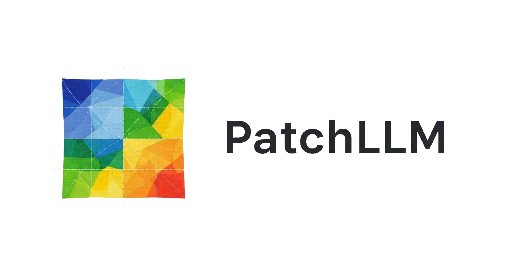

<p align="center">
  <picture>
    <source srcset="./assets/logo_dark.png" media="(prefers-color-scheme: dark)">
    <source srcset="./assets/logo_light.png" media="(prefers-color-scheme: light)">
    
  </picture>
</p>

## About
PatchLLM is a command-line tool that lets you flexibly build LLM context from your codebase, provide instructions, and automatically apply file edits directly from the LLM's response.

## Getting Started

**1. Initialize a configuration file:**
This creates a `scopes.py` file to define file collections.
```bash
patchllm --init
```

**2. (Optional) Create a recipe file:**
Create a `recipes.py` for reusable tasks.
```python
# recipes.py
recipes = {
    "add_tests": "Write comprehensive pytest unit tests for the provided code. Mock any external dependencies.",
    "refactor_dry": "Refactor the code to improve readability and reduce duplication (DRY principle).",
    "add_docs": "Generate Google-style docstrings for all public functions and classes."
}
```

**3. Run a task:**
Combine a **scope**, a **task** (or **recipe**), and an **action** (`--patch`).

```bash
# Run with an ad-hoc task
patchllm -s default -t "Add type hints to the main function" -p

# Run with a pre-defined recipe
patchllm -s default -r add_docs -p
```

## Modes of Operation

- **Direct Mode:** The standard CLI usage shown above.
- **Chat Mode:** A guided, conversational interface for complex changes.
  ```bash
  patchllm --chat
  ```
- **Interactive Mode:** Visually select files and folders to build the context.
  ```bash
  patchllm --interactive -t "My task for the selected files" -p
  ```

## All Commands & Options

#### **Core Actions**
| Flag | Alias | Description |
|---|---|---|
| `--patch` | `-p` | **Main action:** Query the LLM and apply file changes. |
| `--chat` | `-c` | Start an interactive chat session. |
| `--interactive` | `-in`| Interactively select files/folders for the context. |

#### **Task & Recipe Input**
| Flag | Alias | Description |
|---|---|---|
| `--task "<...>" `| `-t` | Provide a specific instruction to the LLM. |
| `--recipe <name>` | `-r` | Use a predefined task from `recipes.py`. |
| `--voice` | `-v` | Use voice recognition for the task instruction. |

#### **Scope & Context Definition**
| Flag | Alias | Description |
|---|---|---|
| `--scope <name>` | `-s` | Use a static scope from `scopes.py` or a dynamic one (e.g., `@git:staged`, `@search:"term"`). |
| `--init` | `-i` | Create a new `scopes.py` file. |
| `--list-scopes`| `-sl`| List all available scopes. |
| `--show-scope` | `-ss`| Display the settings for a specific scope. |

#### **Input/Output**
| Flag | Alias | Description |
|---|---|---|
| `--context-out` | `-co` | Export the generated context to a file (e.g., `context.md`). |
| `--context-in` | `-ci` | Use a local context file as input. |
| `--to-file` | `-tf` | Save LLM response to a file instead of patching. |
| `--to-clipboard`| `-tc`| Copy LLM response to the clipboard. |
| `--from-file` | `-ff` | Apply patches from a local file. |
| `--from-clipboard`|`-fc`| Apply patches from the clipboard. |

#### **General Options**
| Flag | Alias | Description |
|---|---|---|
| `--model` | `-m` | Specify a different model (default: `gemini/gemini-1.5-flash`). |

## Setup

PatchLLM uses [LiteLLM](https://github.com/BerriAI/litellm). Refer to their documentation for setting up API keys (e.g., `OPENAI_API_KEY`, `GEMINI_API_KEY`) in a `.env` file.

Optional features require extra dependencies:
```bash
# For --voice
pip install "patchllm[voice]"

# For URL support in scopes
pip install "patchllm[url]"

# For --interactive and --chat modes
pip install "patchllm[interactive]"
```

## License

This project is licensed under the MIT License. See the `LICENSE` file for details.
